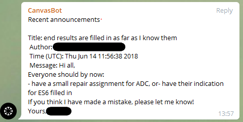

# Canvas telegram bot

This is a telegram bot which reads out Canvas LMS announcements to its subscribers.

## Usage

To use it, retrieve a canvas api token on your profile page. From your Dashboard, go to Account -> Settings. On the bottom of the 'Approved integrations' list, you'll find a '+New access token' button. Click that button to generate an access token. Save it (or symlink it) in the same folder as the `bot.py` application, with the name `canvas-api-key.txt`.

Next, you'll need to retrieve a Telegram bot api token. You can do this by talking to @BotFather on Telegram. Save that as `telegram-api-key.txt`.

You can now run the bot with `python bot.py`.

## Bot usage

To start a conversation, search for the bot with the name you've given it while talking to @BotFather. You can then subscribe to new announcements by using the /subscribe command.

## Inner workings

This bot runs a job every 5 minutes to check for new announcements on the Canvas API. If it finds any, it will push this to the people that have subscribed.

If someone subscribes, it'll write this to a `subscribers.txt` file. This file persists between starts, so subscribers will keep being subscribed if the bot gets restarted.

The bot will both print errors both to the terminal and to a `bot.log` file.
